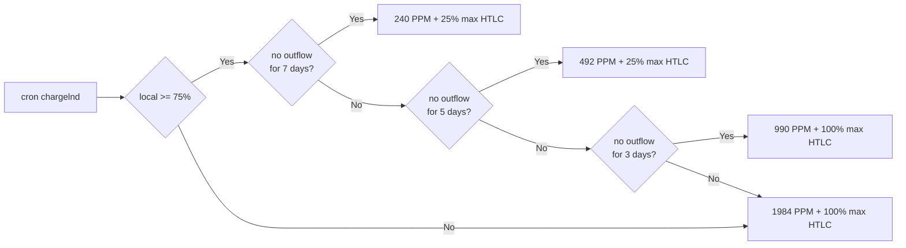
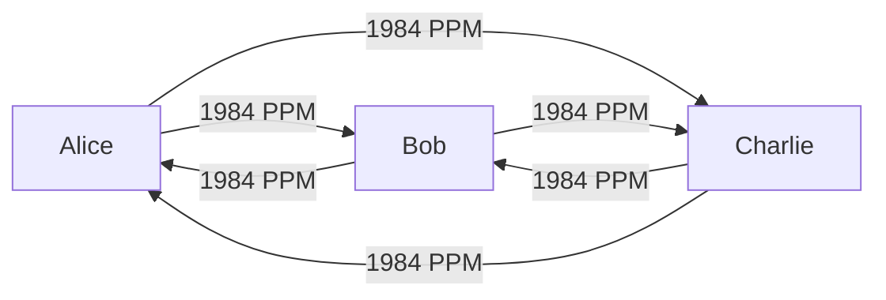

# LND Tools

LND node tools and configs for an Umbrel LND node.
This repo assumes you are running an Umbrel node with LND. This is built to service the Umbrel [Zap-O-Matic](https://amboss.space/node/026d0169e8c220d8e789de1e7543f84b9041bbb3e819ab14b9824d37caa94f1eb2) testnet network nodes.

If you are not on an Umbrel node, adjust directories within this project to fit your paths and docker network.
Or you can simply use the configs without installing cron job scripts.

## Configs

- [chargelnd-coop.config](apps/charge-lnd/chargelnd-coop.config): This is the Cooperative Fee Strategy script that will be scheduled to run daily.
- [chargelnd-htlc.config](apps/charge-lnd/chargelnd-htlc.config): DEPRECATED (this micro-bucketing has turned out to be too granular, leading to unnecessary htlc failures on high traffic routing nodes. You might be able to get away with it by setting the cron to every 1-5 minutes instead of hours. Advanced users only) - updates the max HTLC for each channel based on 1% bucket groups and disables channels that have less than 3% outbound liquidity. Max HTLC is set just below the bucket group (e.g. a channel with between 44%-45% outbound available will be set to a max of 43.9% to provide settlement buffer).

This repo will grow as more tools are solidified outside of the testnet cluster. Some tools may be beta. Please review before using.

## Cooperative Fee Strategy

The Cooperative Fee Strategy (CFS) is a game-theory optimal strategy for a sub-network of lightning routing nodes to share a fee setting that works harmoniously for all parties using the system. It uses a combination of strategies for rebalancing and fee setting that mimics vampires/spiders, without resorting to fully becoming a predator on the network and without falling victim to nodes that prey on weak fee settings. It aims to achieve channel balance through heavy outward rebalancing and a small but wide range of fee adjustments. Despite this, the rules are very simple--much like the [Tit-for-Tat game theory](https://en.wikipedia.org/wiki/Tit_for_tat) strategy, it relies on simplicity to achieve a complex result that functions in both cooperative and predatory strategy environments.

This strategy accounts for vampires, spiders, exchanges, merchants, and special agreements between nodes (e.g. G-Spot 0/0 revenue sharing), and allows manual exclusions for special cases (e.g. Boltz at 0/0 for allowing free swap routing while enjoying assisted revenue on the rebound).

Before explaining how the CFS works, let's first understand a predatory fee structure that works (for a while). A predatory strategy is one in which if everyone on the network used it, everyone would lose. Conversely, in a game-theory optimal cooperative strategy, if everyone uses the strategy, everyone wins (and they even win if others don't use the strategy).

One such predatory system, which exists in the wild today, is the large vampire strategy. The setup here is also very simple. All channels are set to a high static fee (say 2500 PPM--something considered top of the stack for most nodes). However, special exceptions are made for large traffic sinks like exchanges, wallets, large merchant channels, and major connectors (OneKey, ACINQ, Kraken, Binance, BFX, etc)--to which, the fee rate goes up higher (say 3000-4500). This strategy works well for this node because real traffic does not care about fees nearly as much as routing node rebalancing traffic. This node operator can rest assured that 100% of their traffic is real, or is rebalancing by someone managing to charge even higher fees (which would be rare). The rest of the node traffic will be rebalancing output to fill those higher than 2500 rate channels--and they can do it up to a cost of 2500 PPM!--allowing them to traverse more of the network and eat up liquidity using all of the smaller nodes that are connected to it. In this way, this vampire strategy does not expect to route traffic through the 2500 PPM channels--these channel exist solely for outbound rebalancing to refill high value channels, utilizing their connections to the network back into the major nodes.

An additional benefit for the vampire is that they can connect out to other nodes on the network and use those channels to probe the cost of outward rebalancing, adding more liquidity and connections to cheapen the cost of rebalancing high value targets--again, never expecting natural flow on these channels. Once the channel is bled dry to the other side, it is likely that the vampire node can rebalance the full channel contents back in at a relatively low cost.

This system works well--until another vampire tries the exact same strategy and fee rates. Two vampires of the same size cannot cooperate with each other--however, they can prey on the same connections. Ultimately as more vampires appear, the vampire strategy becomes less effective as the network becomes more congested with predatory nodes. Vampires can be bigger or smaller, either preying on other vampires, or allowing themselves to be preyed on, but this results in an upward fee race to infinity as vampires eat each other to climb higher. Ultimately, if every node on the network attempted this system, it would stop working--it only works because it preys on the weak nodes that are not using this predatory strategy.

This model is a great reference point because it contains some great ideas:

1. Use static fees--that way your rates are reliable and the network can always rely on your consistent fees. But this has one flaw--to be cooperative, we want to allow sats to flow naturally or to be cheaply rebalanced inward by our channel partners. For this reason, we need to setup some static fee rules that change predictably and only within a small number of buckets that have specific values for specific reasons (e.g. `1984`, `990`, `492`, `240`).
2. Use rebalancing to refill high value channels--a simple idea that nodes try and often fail at with lower fee rates. Using regular auto-fee tools like LNDg auto-fees, a node is likely to end up in a situation where many channels are bled dry one way while another set of channels are bled dry the other way and the channels that have liquidity can't find a path to refill the channels with no liquidity. Why? Well, one reason could be that the vampires are eating those routes at up to 2500 PPM--however, it may also be because the low fee settings of these channels is an artificial finding that is self-inflicted by not assuming higher fee demand and allowing the network to settle--because that can take a while. Additionally, some of your channels might literally not be providing any value to the network. If they are, ostensibly high fees are surprisingly acceptable. If they are not, you can close these channels.

CFS uses a default fee of `1984` (queue synthwave pop soundtrack), adjusting fees down only when the liquidity is drained `75%+` to one side and remains inactive in the outbound direction for at least `3 days`. Once this timing threshold is hit, the side with the most liquidity reduces their fee to `990 PPM` and max HTLC to `25%` of the channel capacity, allowing lower fee traffic and rebalancing via the cooperative fee network within `2 hops` (including an optional 1 sat base-fee on each hop). After `5 days` of inactivity, the fee is further reduced to `492 PPM`, allowing `4 hops`. After `7 days`, `240 PPM` (`8 hops`). Fees can be lowered again at `14 days` to `108 PPM` (`16 hops`)--however, this is currently not done as we believe this is excessive. If a rebalance cannot be made in 8 hops, it is unlikely to be made at all. Additionally, if a node is not useful for outward rebalancing source material and is not making any real outbound traffic at `240 PPM` for `30 days`, it can be marked for closure.

Additionally, it is recommended that coop nodes use rebalancing to push sats out with an outbound liquidity target of `< 65%` for all but the exception channels (merchants, exchanges, etc ignored by the fee rules) and an input target of `< 70%` and at a max cost of `70%` with a PPM limit of whatever you like (your higher value channels that are not part of the coop network might be `3500`, so you may want to rebalance up to `2500`). This creates a nice `25%` range of "balance" within the channel that will not be pushed or pulled. Nodes cooperating to push out in this way will optimize the sub-network of coop nodes to heal liquidity imbalance at a reasonable cost. The charge-lnd config for CFS lists major nodes that are excluded from the coop fee settings but does not provide alternative rates since these may vary depending on the value that your node brings to the network. Channels that have no traffic for 30 days and that provide no outbound rebalancing value will be marked for closure. In this way, the co-operative network will foster value-add to the network without holding onto dead channels. However, if channels are well managed to add value, this will be an infrequent finding.

The CFS charge-lnd script runs every `5 minutes` for two reasons:

1. It contains a disable rule for channels with lower than 30K sats to prevent force-closures due to the < 0.18 LND reserve limit bug
2. It adjust fees back upward as soon as they get traffic again. This limits abuse of the channels by vampires attempting to bleed it dry at a lower rate, but allows a small window where liquidity can be balanced to a desired state.

Attacks against this strategy are difficult and costly. A large vampire will require much higher fees to take advantage of CFS nodes, and the expense of that attack will benefit the CFS participants as they achieve a reasonable cost for their liquidity that they can refill using the cooperative fee network.

The logic for cooperative fees is simple:



This logic is applied in the [chargelnd-coop.config](apps/charge-lnd/chargelnd-coop.config)

As shown in this triangle connection:



Channels start balanced:

```
A -1984-> [▯▯...▮▮] <-1984- B
B -1984-> [▯▯...▮▮] <-1984- C
C -1984-> [▯▯...▮▮] <-1984- A
```

Traffic flows, and after three days of no outflow for the side with the most liquidity, the fee is reduced to 492:

```
A -1984-> [▯...▮▮▮] <- 492- B
B -1984-> [▯...▮▮▮] <- 492- C
C -1984-> [▯...▮▮▮] <- 492- A
```

These nodes can now rebalance at a low cost of 492 PPM:

`A -> C (free) -> B (492) -> A (492) = 980 PPM` cost to A (plus any base-fee requirements), returning the triangle to perfect harmony.

OR, after 7 days of no outflow, the fee is reduced to 240:
`A -> C (free) -> B (240) -> A (240) = 480 PPM`

```
A -1984-> [▯...▮▮▮] <- 240- B
B -1984-> [▯...▮▮▮] <- 240- C
C -1984-> [▯...▮▮▮] <- 240- A
```

And now the nodes can rebalance for 480 PPM

```
A -1984-> [▯▯...▮▮] <-1984- B
B -1984-> [▯▯...▮▮] <-1984- C
C -1984-> [▯▯...▮▮] <-1984- A

```

> Note that any of the nodes can do this rebalance, and it may not take this route. They can also use the rest of the lightning network to rebalance

These nodes are also resistant to vampires/spiders using them for rebalancing when they don't want to be used--but they will be used for reblancing by large spider nodes when they desire it.

> NOTE: you can run charge-lnd with the `--dry-run` flag to see what the changes would be without actually making them. This is useful for testing and understanding the changes that will be made.

Example on an Umbrel Home node:

```
sudo docker run --rm --network=umbrel_main_network -e GRPC_LOCATION=umbrel.local:10009 -e LND_DIR=/data/.lnd -e CONFIG_LOCATION=/app/chargelnd-coop.config -v /home/umbrel/umbrel/app-data/lightning/data/lnd:/data/.lnd -v /home/umbrel/zap_lnd_tools/apps/charge-lnd:/app zap/charge-lnd:latest --dry-run
```

## Install

> NOTE: this project assumes that you are building your own docker images from source rather than using dockerhub or github published images (as you don't necessarily know what the code is that's on those images and they may become malicious very easily, exploiting your LND directory, which can contain your SEED!) -- we build images using a `zap/` namespace to ensure we are not using docker images that are not built from source.

### Build docker images for tools (charge-lnd, etc)

charge-lnd: https://github.com/accumulator/charge-lnd

```

git clone https://github.com/accumulator/charge-lnd.git
cd charge-lnd
sudo docker build --no-cache -t zap/charge-lnd -f Dockerfile .

```

rebalance-lnd: https://github.com/C-Otto/rebalance-lnd

```

git clone https://github.com/C-Otto/rebalance-lnd.git
cd rebalance-lnd
sudo docker build --no-cache -t zap/rebalance-lnd -f Dockerfile .

```

### zap lnd tools:

```

git clone https://github.com/zapomatic/zap_lnd_tools.git /home/umbrel/zap_lnd_tools
cd /home/umbrel/zap_lnd_tools

# add cron jobs

# write out current crontab

sudo crontab -l > sudo.cron

# add new crons into cron file

# run charge-lnd every 5 minutes to ensure we disable channels with too low volume (nothing changes if the % range of a channel hasn't changed)

# /home/umbrel/zap_lnd_tools/logs/htlc.log will store the last execution output

echo "_/5 _ \* \* \* /home/umbrel/zap_lnd_tools/cronjobs/chargelnd-coop.sh > /home/umbrel/zap_lnd_tools/logs/htlc.log 2>&1" >> sudo.cron

# install new cron file

sudo crontab sudo.cron
rm sudo.cron

```

## Uninstall

```

sudo crontab -e

```

then remove or comment out cronjobs you don't want

## Additional Tools

Check out https://github.com/jvxis/nr-tools run by [Friendspool⚡🍻](https://amboss.space/node/023e24602891c28a7872ea1ad5c1bb41abe4206ae1599bb981e3278a121e7895d6)

```

```
